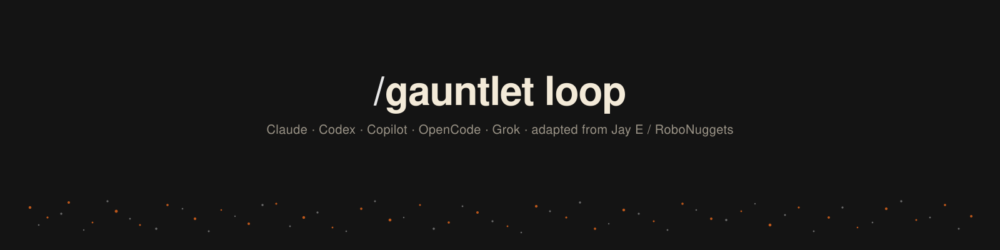

<p align="center">
  
</p>

# Gauntlet Loop

A skill that turns any goal into one short, paste-ready prompt. That prompt makes the agent pick a real quality bar, split the work, run a **builder** and a separate harsh **critic** on each piece, compare blind against the bar, and keep looping until it wins.

This repo is the marketplace for five harnesses. Each one gets its own spawn and loop primitives — Claude Code uses `/loop` and `ultracode`; the others do not.

Adapted from [robonuggets/gauntlet-loop](https://github.com/robonuggets/gauntlet-loop). The technique is [Matt Shumer's](https://github.com/mshumer/Claude-of-Duty).

A Grok-only fork lives at [aaronwJordan/gauntlet-loop-grok](https://github.com/aaronwJordan/gauntlet-loop-grok). This repo is the portable one.

## Install

This repository **is** the marketplace. Add `aaronwJordan/gauntlet-loop`, then install the `gauntlet-loop` plugin.

| Harness | Add marketplace | Install |
|---|---|---|
| **Claude Code** | `/plugin marketplace add aaronwJordan/gauntlet-loop` | `/plugin install gauntlet-loop@gauntlet-loop` |
| **Codex CLI** | `codex plugin marketplace add aaronwJordan/gauntlet-loop` | `codex plugin add gauntlet-loop@gauntlet-loop` |
| **Copilot CLI** | `copilot plugin marketplace add aaronwJordan/gauntlet-loop` | `copilot plugin install gauntlet-loop@gauntlet-loop` |
| **Grok Build** | clone or `grok plugin install aaronwJordan/gauntlet-loop --trust` | skills under `.grok/skills/` |
| **OpenCode** | clone, then point `skills` at this repo's `skills/` directory | see below |

Then:

```
/gauntlet-loop build me a pricing page for my SaaS
```

It offers 2 or 3 bars, you pick one, it writes one prompt. One line under that: it can run the loop here.

### OpenCode (any project)

```bash
git clone https://github.com/aaronwJordan/gauntlet-loop.git ~/.config/opencode/vendor/gauntlet-loop
```

```json
{
  "$schema": "https://opencode.ai/config.json",
  "skills": ["~/.config/opencode/vendor/gauntlet-loop/skills"]
}
```

Cloning this repo as the project cwd also loads `.opencode/skills` and `.opencode/agent/`.

## What is tailored per harness

| | Claude Code | Grok Build | Codex CLI | Copilot CLI | OpenCode |
|---|---|---|---|---|---|
| Keep going | `/loop` | lead loop or `gauntlet` workflow | lead loop | lead loop | lead loop |
| Fan-out | `ultracode` + `Agent` | `spawn_subagent` (depth 1) | `spawn_agent` / `wait_agent` | `task` / `/fleet` | `task` |
| Resume builder | `Agent` `agentId` / `SendMessage` | `resume_from` | `resume_agent` | resume task or new task with gap | new `task` with gap |
| Fresh critic | new `Agent` | new `spawn_subagent` | new `spawn_agent` | new `task` | new `task` |

Shared (all harnesses): named fetchable bar, blind binary critic, no round-count exit, `gauntlet-progress.md`.

`/loop` and `ultracode` appear **only** in the Claude skill and `references/run-claude.md`. Grok, Codex, Copilot, and OpenCode prompts tell the lead to keep looping with that harness's spawn tools instead.

## Layout

```
skills/gauntlet-loop/           dispatcher skill (plugin install)
  references/loop.md            bar, flow, voice
  references/builder.md
  references/critic.md
  references/run-claude.md      /loop + ultracode + Agent
  references/run-grok.md        spawn_subagent + workflow
  references/run-codex.md       spawn_agent
  references/run-copilot.md     task + /fleet
  references/run-opencode.md    task
  workflows/gauntlet.rhai       Grok Build loop
harnesses/<name>/SKILL.md       pre-bound skill for clone-as-project
.claude/skills/                 Claude discovery
.agents/skills/                 Codex discovery
.github/skills/                 Copilot discovery
.opencode/skills/               OpenCode discovery
.grok/skills/                   Grok discovery
plugins/gauntlet-loop/          installable plugin
```

## How it works

1. **You give a goal.**
2. **It offers 2 or 3 bars.** Named, fetchable by *this* session, comparable.
3. **You pick one.** It writes ~150 words and stops.
4. **You paste it, or say run it.** Builder/critic pairs until the critic picks ours.

The critic is a separate agent with fresh context. It opens the actual output, puts it next to the bar with the labels stripped, and picks one. Not a score.

## What breaks it

- A vague bar.
- The builder judging its own work.
- A soft critic (scores instead of a pick).
- A fixed round count.
- Telling a non-Claude session to `/loop` or `ultracode`.

## Credit

Technique: **[Matt Shumer](https://github.com/mshumer)** / [Claude of Duty](https://github.com/mshumer/Claude-of-Duty).

Reusable skill this adapts: **[Jay E / RoboNuggets](https://github.com/robonuggets/gauntlet-loop)**.

## License

[CC BY 4.0](LICENSE). Attribution in [NOTICE.md](NOTICE.md).
